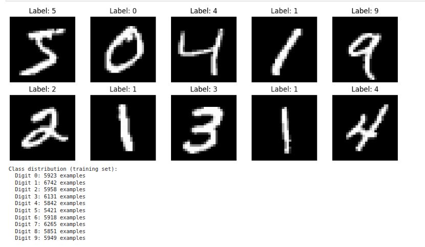
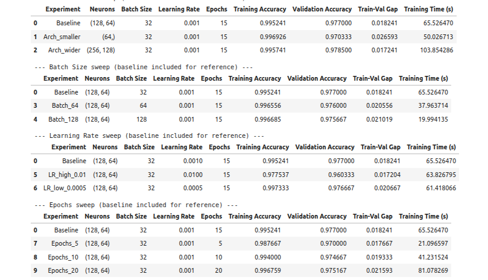
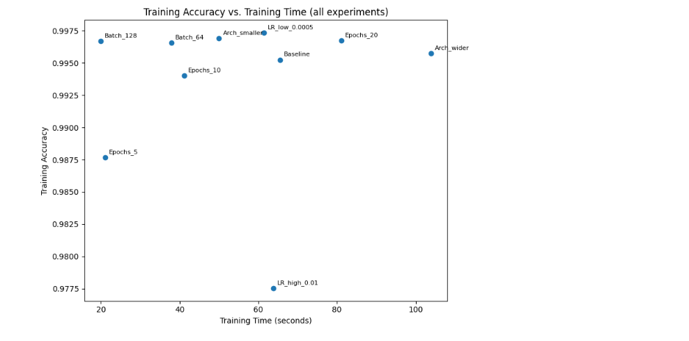
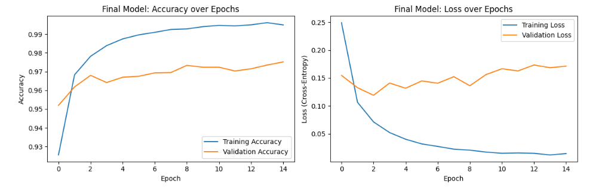
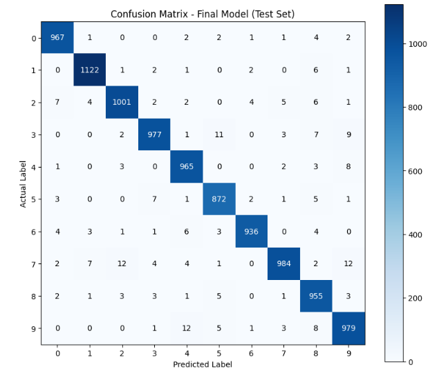
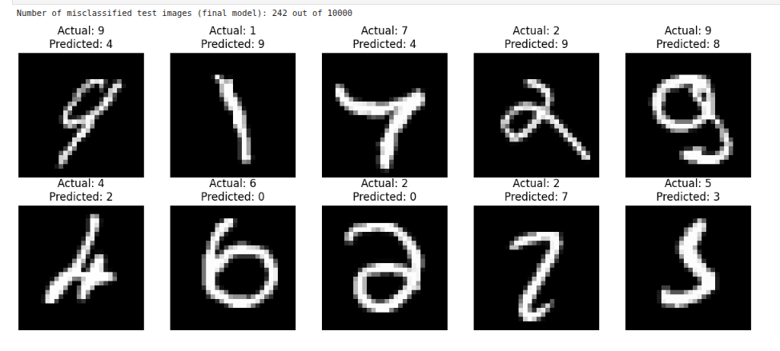
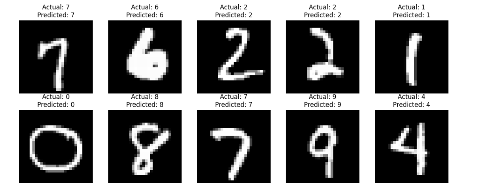

🧠 MNIST Handwritten Digit Recognition using MLP

  <b>Machine Learning • Neural Networks • MLP • Image Classification • TensorFlow/Keras</b>

A machine-learning laboratory project for handwritten digit classification using a Multi-Layer Perceptron (MLP) trained on the MNIST dataset. The project covers data exploration, preprocessing, baseline model development, controlled hyperparameter experiments, final-model evaluation, confusion-matrix analysis, and misclassification analysis.

🚀 Project Overview

The objective is to build and evaluate a neural-network model capable of recognizing handwritten digits from 0 to 9.

Processing Pipeline

MNIST Dataset
      ↓
Data Exploration
      ↓
Preprocessing & Normalization
      ↓
Train / Validation Split
      ↓
Baseline MLP
      ↓
Hyperparameter Experiments
      ↓
Final Model
      ↓
Test Evaluation
      ↓
Confusion Matrix
      ↓
Misclassification Analysis

✨ Key Features

🔢 Handwritten digit classification for 10 classes (0–9)

🖼️ Visualization of MNIST samples

📊 Class-distribution analysis

🧠 Multi-Layer Perceptron neural network

⚙️ Architecture, batch-size, learning-rate, and epoch experiments

📈 Training and validation accuracy/loss analysis

⏱️ Training-time comparison

🧩 Confusion-matrix evaluation

❌ Misclassified-image analysis

💾 Model saving and reloading

🖼️ Dataset Exploration

The project visualizes sample MNIST digits and examines the distribution of the ten digit classes.

  

Training-set Class Distribution

Digit 0 : 5923 examples
Digit 1 : 6742 examples
Digit 2 : 5958 examples
Digit 3 : 6131 examples
Digit 4 : 5842 examples
Digit 5 : 5421 examples
Digit 6 : 5918 examples
Digit 7 : 6265 examples
Digit 8 : 5851 examples
Digit 9 : 5949 examples

🧠 MLP Architecture

The baseline model uses two hidden layers:

Input Layer
     ↓
Dense Layer: 128 neurons
     ↓
Dense Layer: 64 neurons
     ↓
Output Layer: 10 classes

The output layer represents the ten possible digit classes:

0  1  2  3  4  5  6  7  8  9

🧪 Hyperparameter Experiments

Multiple controlled experiments were performed by varying:

Network architecture

Batch size

Learning rate

Number of epochs

Architecture

Baseline       → (128, 64)
Arch_smaller   → (64)
Arch_wider     → (256, 128)

Batch Size

32
64
128

Learning Rate

0.001
0.01
0.0005

Epochs

5
10
15
20

Experiment Results

Experiment

Architecture

Batch Size

Learning Rate

Epochs

Training Accuracy

Validation Accuracy

Baseline

(128, 64)

32

0.001

15

0.995241

0.977000

Arch_smaller

(64)

32

0.001

15

0.996926

0.970333

Arch_wider

(256, 128)

32

0.001

15

0.995741

0.978500

Batch_64

(128, 64)

64

0.001

15

0.996556

0.976000

Batch_128

(128, 64)

128

0.001

15

0.996685

0.975667

LR_high_0.01

(128, 64)

32

0.01

15

0.977537

0.960333

LR_low_0.0005

(128, 64)

32

0.0005

15

0.997333

0.976667

Epochs_5

(128, 64)

32

0.001

5

0.987667

0.970000

Epochs_10

(128, 64)

32

0.001

10

0.994000

0.974667

Epochs_20

(128, 64)

32

0.001

20

0.996759

0.975167

  

⏱️ Training Accuracy vs. Training Time

The experiments were also compared in terms of training accuracy and computational time.

  

📈 Final Model Training

The training curves show the evolution of training and validation accuracy and loss over the training epochs.

  

🎯 Final Model Performance

The recorded final-model results are:

Metric

Result

Training Accuracy

99.49%

Validation Accuracy

97.52%

Test Accuracy

97.58%

Test Loss

0.1311

MSE

0.004116

The final model achieved 97.58% accuracy on the MNIST test set.

🧩 Confusion Matrix

The confusion matrix provides class-wise information about correct predictions and the digit classes that are most frequently confused.

  

The diagonal entries represent correctly classified samples, while off-diagonal entries represent classification errors.

❌ Misclassification Analysis

The final model misclassified:

242 out of 10,000 test images

Examples of incorrect predictions are shown below.

  

These examples provide insight into visually similar handwritten digits that can be difficult for the classifier to distinguish.

✅ Correctly Classified Examples

Examples of correctly classified test images are also included for visual verification.

  

💾 Model Saving and Reloading

The trained model is saved in Keras format:

mnist_mlp_final.keras

The workflow is:

Train
  ↓
Save Model
  ↓
Reload Model
  ↓
Evaluate
  ↓
Predict

🛠️ Technologies Used

Programming Language

Python

Machine Learning

TensorFlow

Keras

Numerical & Data Processing

NumPy

Pandas

Visualization

Matplotlib

Seaborn

Evaluation

Scikit-learn

Environment

Jupyter Notebook

Google Colab compatible workflow

📁 Project Structure

MNIST-Handwritten-Digit-Recognition-MLP/
│
├── README.md
├── MNIST_MLP.ipynb
├── mnist_mlp_final.keras
│
└── output-images/
    ├── mnist-sample-distribution.png
    ├── hyperparameter-results.png
    ├── training-time-comparison.png
    ├── final-training-curves.png
    ├── confusion-matrix.png
    ├── misclassified-images.png
    └── correctly-classified-images.png

▶️ How to Run

1. Clone the repository

git clone <YOUR-REPOSITORY-URL>
cd MNIST-Handwritten-Digit-Recognition-MLP

2. Install dependencies

pip install tensorflow numpy pandas matplotlib seaborn scikit-learn jupyter

3. Open the notebook

Open:

MNIST_MLP.ipynb

using Jupyter Notebook or Google Colab.

4. Run the notebook

Execute the cells sequentially:

Dataset Loading
      ↓
Data Exploration
      ↓
Preprocessing
      ↓
Baseline Training
      ↓
Hyperparameter Experiments
      ↓
Final Model Training
      ↓
Evaluation
      ↓
Error Analysis

🎓 Learning Outcomes

This project provides practical experience with:

Machine-learning workflow design

Multi-Layer Perceptrons

Neural-network training

Image classification

Data preprocessing

Hyperparameter experimentation

Training/validation analysis

Confusion-matrix interpretation

Misclassification analysis

Model persistence

Neural-network inference

🔬 Possible Future Improvements

🧠 Compare the MLP with a Convolutional Neural Network (CNN)

🧩 Add dropout and regularization experiments

⏹️ Add early stopping

📈 Add learning-rate scheduling

📊 Perform per-class precision and recall analysis

✍️ Build an interactive handwritten-digit drawing interface

⭐ Project Highlights

🔢 MNIST Digit Classification
🧠 Multi-Layer Perceptron
⚙️ Hyperparameter Experiments
📈 Accuracy & Loss Analysis
⏱️ Training-Time Comparison
🧩 Confusion Matrix
❌ Misclassification Analysis
💾 Model Saving & Reloading
🐍 Python
⚡ TensorFlow / Keras

👨‍💻 Author

AmarDeep Dwivedi

M.Tech
Electrical Engineering — CSPML
IIT Dharwad

📜 License

This project is intended for educational and research purposes.

  <b>🔢 From Pixels → Neural Network → Classification → Analysis</b>

