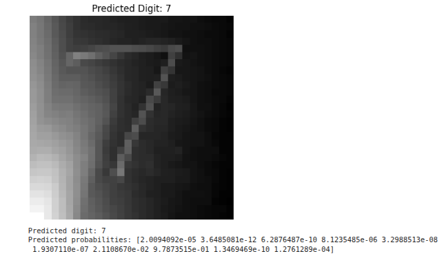

# 🧠 MNIST Handwritten Digit Recognition using MLP

<p align="center">
  <b>Machine Learning • Neural Networks • MLP • Image Classification • TensorFlow/Keras</b>
</p>

A machine-learning project for handwritten digit classification using a **Multi-Layer Perceptron (MLP)** trained on the **MNIST dataset**. The project covers data exploration, preprocessing, baseline model development, controlled hyperparameter experiments, final-model evaluation, confusion-matrix analysis, and misclassification analysis.

---

## 🚀 Project Overview

The objective is to build and evaluate a neural-network model capable of recognizing handwritten digits from **0 to 9**.

### Processing Pipeline

```text
MNIST Dataset
      ↓
Data Exploration
      ↓
Preprocessing & Normalization
      ↓
Train / Validation Split
      ↓
Baseline MLP
      ↓
Hyperparameter Experiments
      ↓
Final Model
      ↓
Test Evaluation
      ↓
Confusion Matrix
      ↓
Misclassification Analysis
```

---

## ✨ Key Features

- 🔢 Handwritten digit classification for 10 classes (0–9)
- 🖼️ MNIST sample visualization
- 📊 Class-distribution analysis
- 🧠 Multi-Layer Perceptron neural network
- ⚙️ Architecture experiments
- 📦 Batch-size experiments
- 📈 Learning-rate and epoch experiments
- ⏱️ Training-time comparison
- 📉 Training and validation loss analysis
- 📈 Training and validation accuracy analysis
- 🧩 Confusion-matrix evaluation
- ❌ Misclassified-image analysis
- 💾 Model saving and reloading
- ✍️ Custom handwritten-digit prediction

---

## 🖼️ MNIST Dataset

The project uses the **MNIST handwritten digit dataset**, containing grayscale images of handwritten digits from 0 to 9.

The notebook also visualizes representative samples and examines the class distribution in the training set.

> **Note:** The repository currently includes selected result images in `output-images/`.

---

## 🧠 MLP Architecture

The baseline network uses two hidden layers:

```text
Input Layer
     ↓
Dense Layer: 128 neurons
     ↓
Dense Layer: 64 neurons
     ↓
Output Layer: 10 classes
```

The output layer represents the ten digit classes:

```text
0  1  2  3  4  5  6  7  8  9
```

---

## 🧪 Hyperparameter Experiments

The project compares multiple configurations by changing:

- Network architecture
- Batch size
- Learning rate
- Number of epochs

### Architecture Experiments

```text
Baseline       → (128, 64)
Arch_smaller   → (64)
Arch_wider     → (256, 128)
```

### Batch Size Experiments

```text
32
64
128
```

### Learning Rate Experiments

```text
0.001
0.01
0.0005
```

### Epoch Experiments

```text
5
10
15
20
```

The experiment results are summarized in the notebook and visualized in the repository.

---

## 📊 Experimental Results

### Hyperparameter Comparison

<p align="center">
  
</p>

The comparison shows how changes in architecture, batch size, learning rate, and number of epochs affect training and validation performance.

---

## ⏱️ Training Accuracy vs. Training Time

<p align="center">
  
</p>

This plot compares the training accuracy achieved by the different experiments with their corresponding training time.

---

## 📈 Final Model Training

The final model's training history is visualized using training and validation accuracy and loss.

<p align="center">
  
</p>

The curves provide a visual comparison between model performance on the training data and validation data across epochs.

---

## 🎯 Final Model Performance

The recorded final-model results are:

| Metric | Result |
|---|---:|
| Training Accuracy | **99.49%** |
| Validation Accuracy | **97.52%** |
| Test Accuracy | **97.58%** |
| Test Loss | **0.1311** |
| MSE | **0.004116** |

The final model achieved **97.58% test accuracy** on the MNIST test set.

---

## 🧩 Confusion Matrix

The confusion matrix provides class-wise information about the final model's predictions.

<p align="center">
  
</p>

The diagonal entries represent correctly classified samples, while off-diagonal entries represent classification errors between digit classes.

---

## ❌ Misclassification Analysis

The final model produced:

```text
242 misclassified images out of 10,000 test images
```

Examples of incorrect predictions are shown below.

<p align="center">
  
</p>

These examples help visualize cases where handwritten digits are difficult for the classifier to distinguish.

---

## ✍️ Custom Handwritten Digit Prediction

The trained model is also used for handwritten digit prediction.

<p align="center">
  
</p>

This demonstrates the inference stage of the trained classifier beyond the main evaluation plots.

---

## 💾 Model Saving and Reloading

The trained model is saved in Keras format:

```text
mnist_mlp_final.keras
```

The workflow is:

```text
Train
  ↓
Save Model
  ↓
Reload Model
  ↓
Evaluate
  ↓
Predict
```

Saving and reloading the model demonstrates that the trained network can be preserved and reused for later inference.

---

## 🛠️ Technologies Used

- **Python**
- **TensorFlow / Keras**
- **NumPy**
- **Pandas**
- **Matplotlib**
- **Seaborn**
- **Scikit-learn**
- **Jupyter Notebook / Google Colab**

---

## 📁 Project Structure

```text
MNIST-Handwritten-Digit-Recognition-MLP/
│
├── README.md
├── MNIST_MLP.ipynb
├── mnist_mlp_final.keras
│
└── output-images/
    ├── confusion-matrix.png
    ├── custom-digit-prediction.png
    ├── final-training-curves.png
    ├── hyperparameter-results.png
    ├── misclassified-images.png
    └── training-time-comparison.png
```

---

## ▶️ How to Run

### 1. Clone the repository

```bash
git clone <YOUR-REPOSITORY-URL>
cd MNIST-Handwritten-Digit-Recognition-MLP
```

### 2. Install dependencies

```bash
pip install tensorflow numpy pandas matplotlib seaborn scikit-learn jupyter
```

### 3. Open the notebook

Open the notebook in **Jupyter Notebook** or **Google Colab**.

```text
MNIST_MLP.ipynb
```

### 4. Run the notebook sequentially

Run the cells in order to perform:

```text
Dataset Loading
      ↓
Data Exploration
      ↓
Preprocessing
      ↓
Baseline Training
      ↓
Hyperparameter Experiments
      ↓
Final Model Training
      ↓
Evaluation
      ↓
Error Analysis
      ↓
Prediction
```

---

## 🎓 Learning Outcomes

This project provides practical experience with:

- Machine-learning workflow design
- Multi-Layer Perceptrons
- Neural-network training
- Image classification
- Data preprocessing
- Hyperparameter experimentation
- Training and validation analysis
- Confusion-matrix interpretation
- Misclassification analysis
- Model persistence
- Neural-network inference

---

## 🔬 Possible Future Improvements

- 🧠 Compare the MLP with a Convolutional Neural Network (CNN)
- 🧩 Add dropout and regularization experiments
- ⏹️ Add early stopping
- 📈 Add learning-rate scheduling
- 📊 Perform per-class precision and recall analysis
- ✍️ Build an interactive handwritten-digit drawing interface

---

## ⭐ Project Highlights

```text
🔢 MNIST Digit Classification
🧠 Multi-Layer Perceptron
⚙️ Hyperparameter Experiments
📈 Accuracy & Loss Analysis
⏱️ Training-Time Comparison
🧩 Confusion Matrix
❌ Misclassification Analysis
💾 Model Saving & Reloading
✍️ Custom Digit Prediction
🐍 Python
⚡ TensorFlow / Keras
```

---

## 👨‍💻 Author

**AmarDeep Dwivedi**

M.Tech 
Electrical Engineering — CSPML  
IIT Dharwad

---

## 📜 License

This project is intended for educational and research purposes.

---

<p align="center">
  <b>🔢 From Pixels → Neural Network → Classification → Analysis</b>
</p>
